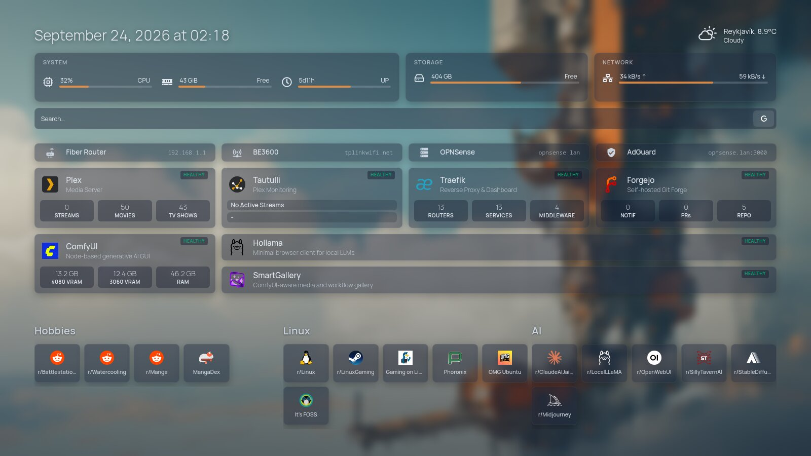

# homepage-config

My [Homepage](https://gethomepage.dev) dashboard config: a frosted-glass theme over a background image, with a flat grid of service cards and bookmarks as logo tiles.

## Usage

Mount this repo as Homepage's config directory (`/app/config`), and `icons/` into `/app/public/icons`. Most service cards come from Docker labels in [delfianto/compose](https://github.com/delfianto/compose).

`icons/` isn't in the repo, so bring your own `background.jpg`.

The weather location comes from `HOMEPAGE_VAR_WEATHER_LABEL`, `_LAT`, `_LON` and `_TZ` env vars on the Homepage container.

## License

[MIT](LICENSE)
